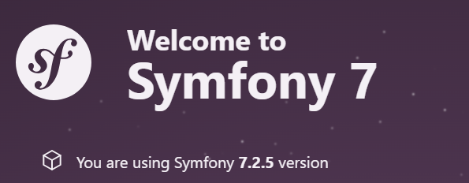

# joml21-bth-mvc-2025

This is a training site created with Symfony

To access this website locally you need to do the following:
Install PHP in your terminal
Install Composer
Clone this repo
Make an installation of Composer with 'composer install' in the project root directory
Run the server with 'symfony server:start'
Enjoy the site through: 'https://127.0.0.1:8000'
Close server with CTRL-C

Related info on:
https://github.com/dbwebb-se/mvc

Copyright (c) joml21